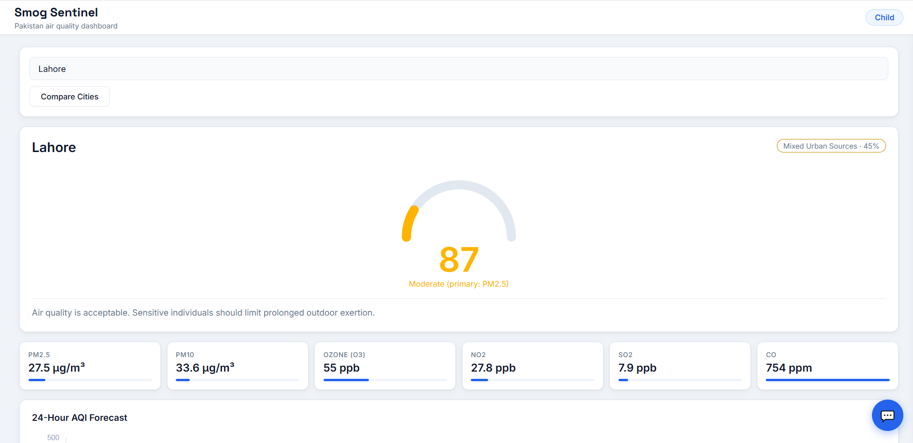
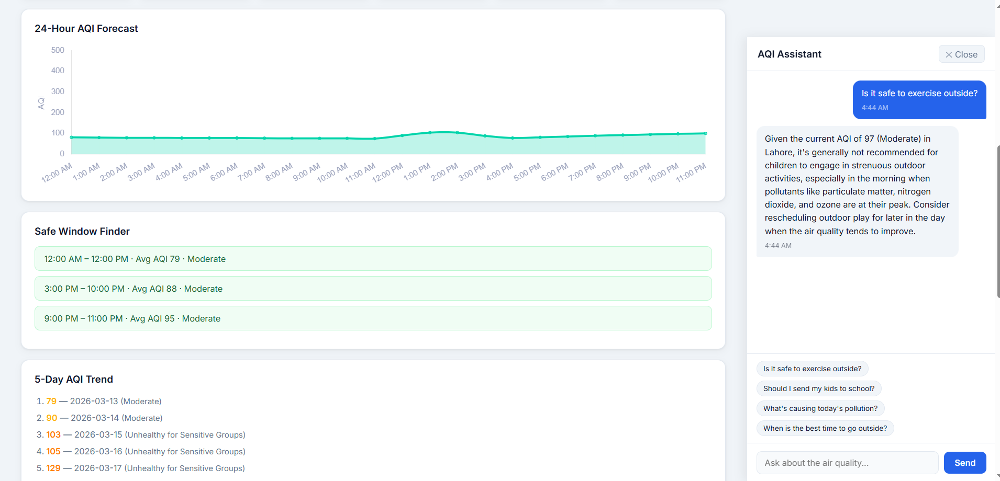
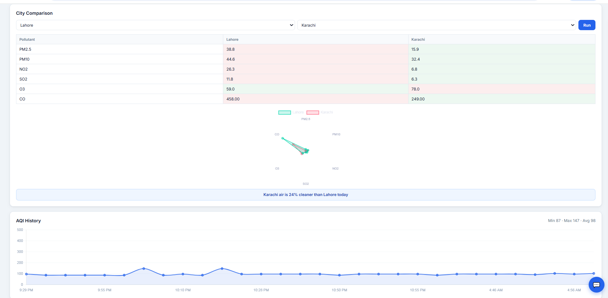

# Smog Sentinel

Real-time air quality monitoring dashboard for Pakistan cities.

---

## Features

**Live AQI — US EPA Standard**
Fetches hourly atmospheric data from Open-Meteo and applies the US EPA linear interpolation formula across 6 breakpoint ranges (Good → Hazardous) to compute AQI from raw µg/m³ concentrations. The dashboard takes the maximum sub-index across all pollutants and surfaces the primary pollutant driving the reading — the same methodology used by AirNow.gov.

**Pollutant Breakdown — PM2.5, PM10, O3, NO2, SO2, CO**
Each pollutant is displayed with its raw concentration, unit, and a proportional severity bar. Values are sourced from the CAMS European atmospheric model via Open-Meteo, updated hourly. All 6 pollutants feed into both the AQI calculation and the pollution source classifier.

**Pollution Source Detection**
A rule-based classifier analyzes pollutant ratios and time-of-day context to identify the likely emission source with a confidence score:
- PM10/PM2.5 > 3:1 with low SO2 → dust or construction (coarse particles, no combustion)
- CO > 800 + NO2 > 40 → heavy vehicular traffic (combustion + engine heat signature)
- SO2 > 20 → industrial activity or brick kilns (coal/heavy fuel combustion)
- PM2.5 > 60 in Oct–Jan in Lahore, Multan, Faisalabad → crop stubble burning (Punjab harvest season)
- Elevated NO2 during 7–10am or 5–8pm → rush hour traffic pattern
- O3 > 100 between 12–4pm → secondary photochemical smog (solar-driven NOx reaction)

**24-Hour AQI Forecast + 5-Day Trend**
Renders a Chart.js line chart using 24 hourly AQI forecast values from the Open-Meteo response. The 5-day trend aggregates hourly data into daily averages and color-codes each day by EPA category, giving users a week-level pollution outlook.

**Safe Outdoor Window Finder**
Scans the next 48 hours of forecast AQI data to find consecutive time windows where AQI stays below 100. Returns the top 3 windows sorted by average AQI. If no window exists below the threshold, falls back to the single lowest 2-hour slot. Gives users a concrete answer to "when can I go outside today?"

**City vs City Comparison**
Fetches two cities simultaneously using `Promise.all()` and renders a side-by-side pollutant table with red/green cell highlighting per pollutant. A Chart.js radar chart overlays both cities across all 6 pollutants for visual comparison. Outputs a plain-English winner statement with percentage difference in AQI.

**Health Profile Warnings**
Users select a health profile on first visit (Healthy Adult, Child, Elderly, Asthma/Respiratory, Heart Condition, Pregnant), stored in localStorage. The profile overrides the generic AQI guideline with condition-specific clinical advice at defined thresholds — e.g. inhaler reminders for Asthma above AQI 100, outdoor restriction for Children above 100, full indoor advisory for Pregnant above 150. The profile is also injected into every AI prompt so the chatbot personalizes responses to the user's condition.

**AI Chat Assistant — Domain-Scoped**
Powered by Groq API (Llama 3.1, free tier). Every message injects the full current data context into the system prompt: city, AQI, all 6 pollutant readings, 24h trend direction, season, health profile, and local time. The system prompt enforces strict domain scope — the model returns a fixed refusal string for any non-air-quality question. Quick-question buttons surface the most common user queries.

**AQI History Log**
Every city load appends `{city, aqi, timestamp}` to localStorage (capped at 30 entries). A Chart.js line chart renders the full session history with min, max, and average stats. Provides longitudinal context that the live API cannot — showing how AQI has changed across the user's session.

---

## Tech Stack

| | Tool |
|---|---|
| Frontend | Vanilla HTML / CSS / JS | 
| Air quality data | Open-Meteo Air Quality API | 
| City search | Open-Meteo Geocoding API |
| Charts | Chart.js (CDN) |
| AI chat | Groq API — Llama 3.1 8B |
| Hosting | GitHub Pages |

---

## Setup

```bash
git clone https://github.com/areej8/smog-sentinel.git
cd smog-sentinel
```

Add your Groq key to `config.js`:
```js
const GROQ_API_KEY = 'gsk_your_key_here';
```

Run locally:
```bash
python -m http.server 8000
# open http://localhost:8000
```


---

## Structure

```
smog-sentinel/
├── index.html
├── style.css
├── app.js
├── config.js
├── api/
│   ├── airQuality.js
│   └── geocoding.js
├── utils/
│   ├── aqiCalculator.js
│   ├── healthGuidelines.js
│   └── pakistanCities.js
└── components/
    ├── chart.js
    ├── pollutantCards.js
    └── alertBanner.js
```

---

## Screenshots





